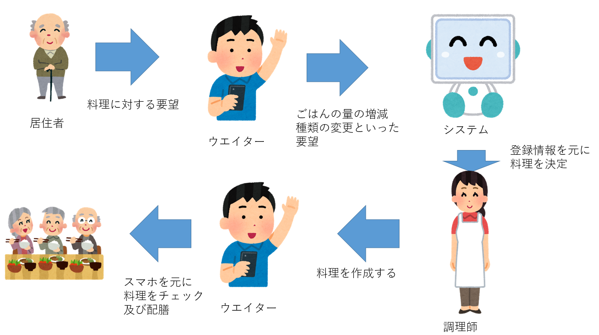

# 伝票くん。
2020年7月6日 大規模ソフトウェア論 グループ1 要求仕様書

# システムの目的
介護施設におけるレストランでは、居住者からの要望やアレルギーによる料理の変更が多い。以下に例を挙げる。  
- こんにゃくが食べれないため、小鉢の料理を変更する
- 塩分を少なめにするため、みそ汁を薄める
- 体調がすぐれないため、ごはんの量を少なくする
アレルギーといった情報は、現在は居住者ごとに立札があり、記載されている。また、いくつかの要望はレストランに入室後に、ウエイターを通じて調理師に伝えられる。  
ウエイターは紙と立札を利用し、調理師に要望を伝達するため、情報の伝達ミスが発生しやすい。そのため、最終確認時にミスが発覚し、料理が作り直しになることがあり、料理の提供が発生することが度々ある。  
  
本システム「伝票くん。」を利用することで、そういった情報を一元管理し、情報伝達の祖語をなくす。また、情報に応じた料理を示すことで、調理師の負担やミスの減少が期待できる。

# システムの概要
- ウエイターは、レストランに入室した居住者に対し、料理の要望を聞く。それをスマートフォンやタブレットに入力する。
- システムが入力されたデータを元に、調理師に料理情報を提供する。
- 調理師が作成した料理を、ウエイターがスマホの情報を元に確認し、居住者に提供する。

# 機能要件

## 居住者を見分ける

## 要望を入力する

ウェイターが居住者から受けた要望を入力する機能。

扱う要望はメニューの変更及びメニュー毎の数量の変更である。

## 要望、メイン情報から、料理を決定する機能

## ウェイターと調理師が上の情報を参照出来る機能(完成品の確認)
ウェイターと調理師が居住者ごとに名前、禁止食材(アレルギーなど)、基本のごはんの量、減塩対応の情報、ソースやドレッシングに関する情報参照することができる機能。
居住者に料理を提供する際に、調理師は表示された情報によって食材を確認し、ウェイターは表示された情報と比較して間違いがないかを確認する。

## データベース更新(前提？)、過去の情報(食べた料理)をさかのぼれる
